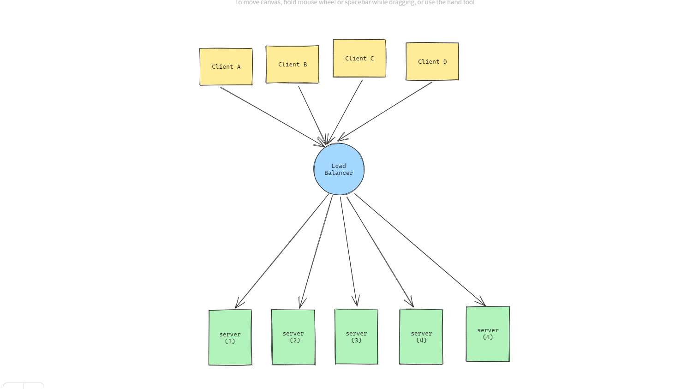

# Scaliblity


### Single Server Design

There will be only one server that is handling all kind of request. and there will database and all everything attatched to this particular server.

**Disadvantages**

- Single Point of Failure: If this server goes down then you are dead

Now there are different ways to scale and overcome this problem. Out of which, these are two main ways

**Types of Scaling**

- Vertical Scaling
- Horizontal Scaling

### Vertical Scaling

This is one of the common approach, when you feel that your app need more resources to handle incoming
requests then just scale your exisiting server. and we can do the same with database as well... just increase the size of that database.

**Advantages**

- Less complexity

**Disadvantages**

- Still single point of failure. if either of database or server goes down then you app will stop working.

### Horizonatal Scaling:




In this approach, you basically add multiple servers, and there will be one load balancer that will manage requests among those server. basically will decide where to send this request(probably with less load).

So, If in this case, if one server is down then load balancer will route that request to another server.

`Warning`: In this case, you have to make sure that you server are stateless, or else it might not work excatly the way you want.

For example, if there are subsequent requests and one request depends on something that has been previously done in that particular, then this approach might not be that effective

Example:

```
If Server A handled the first request and stored session data (like authenticated user information or
temporary data), then subsequent requests routed to Server B won't have access to that session data,
since Server B has its own separate memory. 
```